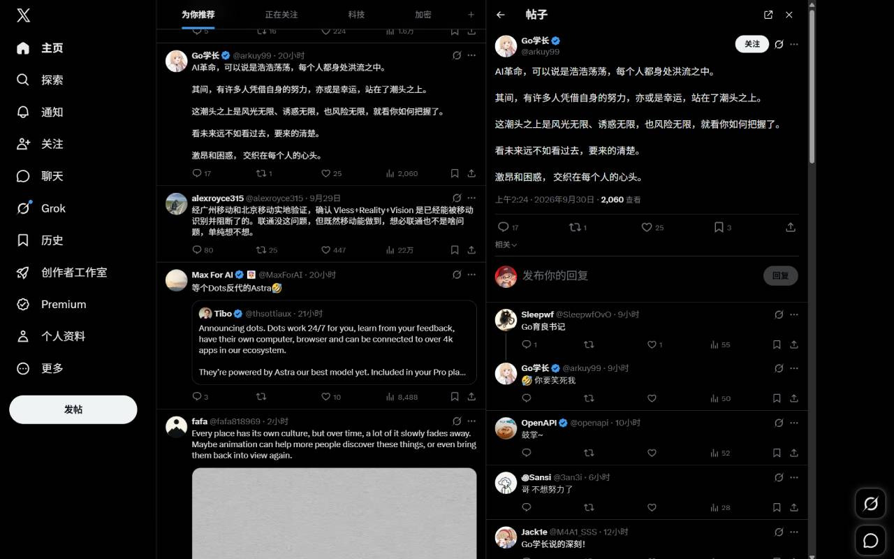
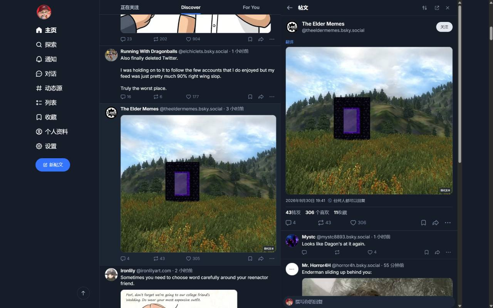
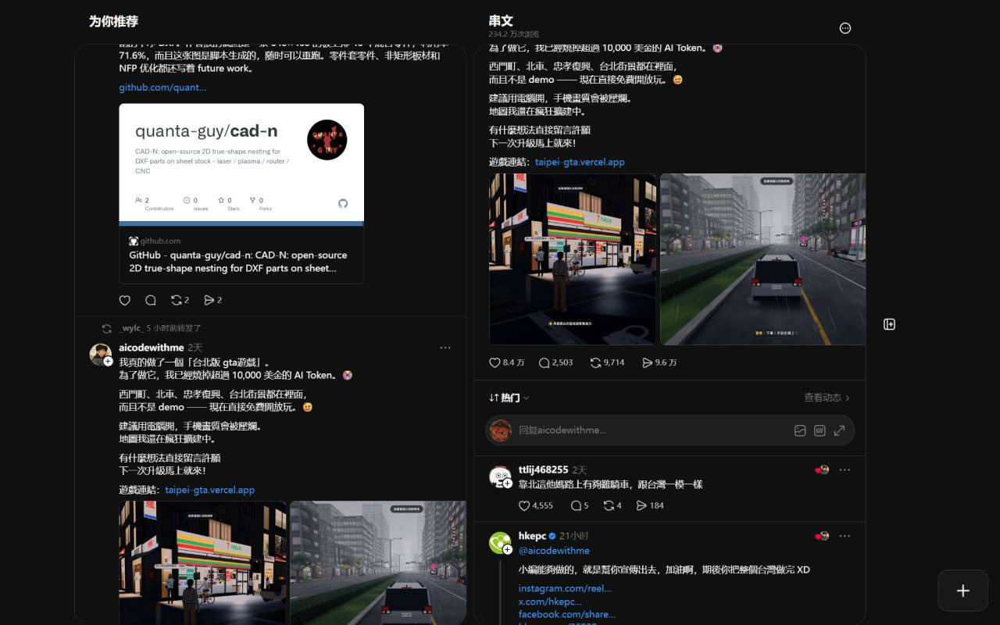
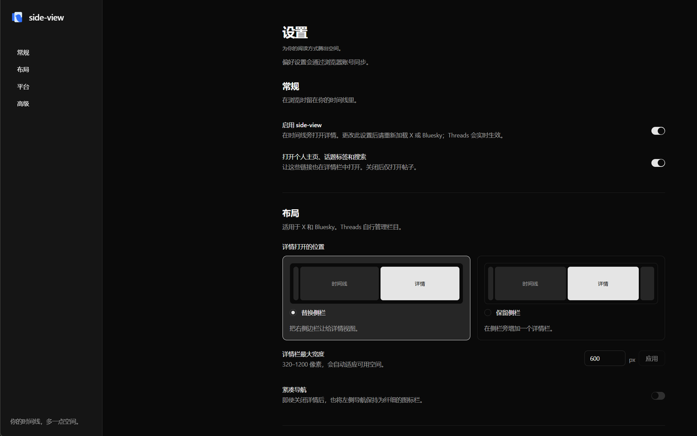

<p align="center">
  <a href="README.md">English</a> ·
  <a href="README.zh-CN.md">简体中文</a> ·
  <a href="README.zh-TW.md">繁體中文</a> ·
  <a href="README.ja.md">日本語</a>
</p>

# Side View

**看貼文，不弄丟時間軸。**

[](https://chromewebstore.google.com/detail/side-view-%E2%80%94-social-post-s/hbplammjgakmogfiaobijlngllblpjhm)
[](https://developer.chrome.com/docs/extensions/develop/migrate)
[](https://www.google.com/chrome/)
[](https://github.com/YoungSx/side-view/commits/main)



你一定也有過這種經驗：正看到一半，某則貼文吸引了你的目光，你點下去——整個動態就這樣不見了。
想看回剛才的內容，只能一路捲回去，而一分鐘前在讀的那些東西，早就不知道去哪了。

Side View 會把這則貼文**開在時間軸旁邊的側欄裡**。你的動態紋絲不動地留在原位。看完了、回完
文、把下面的留言翻完了，隨手關掉——眼前還是同一個畫面。

支援 **X**、**Bluesky** 和 **Threads**。

---

## 它到底做了什麼

在動態裡點任何一則貼文，它不會整頁蓋掉你的畫面，而是在旁邊打開。再點另一則，還是同一個位
置。關掉之後，你的时间軸原封不動——你根本沒有離開過。

就這樣而已。不用裝新 App、不用註冊、不用換網站。你還是以自己的身分登入，貼文也完全照網站
原本的樣子呈現：串文、圖片、影片、投票和留言，一樣都不少。

- **開什麼由你決定。** 可以把個人頁面、主題標籤和搜尋排除在外，只讓貼文用這種方式打開。
- **多寬由你決定。** 320 到 1200 像素隨你挑，配合你的視窗大小。
- **導覽列佔多少也由你決定。** 可以收成一條窄窄的圖示列，也可以完全保持原樣。
- **四種語言。** English、繁體中文、简体中文、日本語，也可以直接跟著瀏覽器走。

## 各平台的表現

**在 X 和 Bluesky 上**，側欄由 Side View 自己繪製，放在你的動態旁邊。你可以讓它佔用右側原來
的側邊欄，也可以讓它和側邊欄並排、兩個都留著。

**在 Threads 首頁**，沒有側邊欄可以佔用，所以 Side View 沿用了 Threads 內建的分欄功能——
一欄原生的 Threads 分欄，存在你的 Threads 帳號裡，每次打開貼文都沿用同一欄。它用起來跟任何
一欄 Threads 分欄沒兩樣：一樣能拖曳、能調整寬度、能照你習慣捲動。
在獨立的動態、關注、收藏、已讚、為你推薦、封存、自訂動態源和搜尋頁面，詳情使用臨時原生欄，
保留目前網址，不向帳號儲存新欄位。透過原生欄位選單即可關閉。獨立頁面需要容納兩個 640 CSS 像素的欄位和原生導覽的
視窗寬度；空間不足或原生元件無法使用時，保留正常跳轉。





## 開始使用

1. 從 [Chrome 應用程式商店](https://chromewebstore.google.com/detail/side-view-%E2%80%94-social-post-s/hbplammjgakmogfiaobijlngllblpjhm)安裝 Side View。
2. 像平常一樣打開 X、Bluesky 或 Threads，其他都不用設定。
3. 點一則貼文，它就在時間軸旁邊打開了。

如果你想讓貼文單獨占一頁，每個詳情面板上都有「在新分頁開啟」的按鈕。

## 你的設定

從瀏覽器的擴充功能選單打開設定頁。它有自己的分頁，不會礙事，改完即時儲存。



## 你的隱私

Side View 沒有伺服器、沒有帳號，也沒有任何統計。它只是從你正在看的頁面裡讀出你點的那則貼文，
顯示在側欄裡，然後就不再管它。你的設定留在你自己的瀏覽器裡。任何資訊都不會被收集、販售或
傳送到其他地方。

有一點需要說明：Threads 那一欄是由 Threads 自己建立、存到**你的 Threads 帳號**裡的——
這是 Threads 的行為，不是我們的。關閉 Side View、或者把它移除，都不會刪掉這一欄。想刪的話，
在 Threads 自己的分欄選單裡點兩下就行，細節寫在[隱私權政策](docs/privacy-policy.md)。

## 一些說明

- **Side View 是一個獨立的擴充功能**，與 X、Bluesky、Meta 沒有任何隸屬、背書或贊助關係。
- **網站會變。** Side View 依附在各網站自己的版面配置上，所以網站一改版，功能可能要等更新
  之後才能恢復。到時候記得[告訴我們](docs/support.md)。
- **不用註冊帳號。** 沒有要註冊的東西，也沒有要付的錢——Side View 就是一個裝了就能用的瀏覽器
  擴充功能。
- **你的時間軸永遠不會被改動。** Side View 不會重排、隱藏或改寫任何內容。關掉之後，頁面和你
  操作之前一模一樣。

## 取得協助

問題回報、功能建議、疑問，都去同一個地方：
**[GitHub Issues](https://github.com/YoungSx/side-view/issues)**。該附上什麼，[docs/support.md](docs/support.md)
裡有一份簡短清單；如果不方便公開留言，那裡也留了信箱。

## 自己動手建置

Side View 是開放原始碼的。需要 Node 22+ 和 pnpm 10：

```bash
git clone https://github.com/YoungSx/side-view.git
cd side-view
pnpm install
pnpm dev      # 支援熱重新載入的開發建置
pnpm build    # 正式建置 → .output/chrome-mv3
pnpm test     # 執行測試
```

在 `chrome://extensions` 把 `.output/chrome-mv3` 以「載入未封裝的擴充功能」載入。架構說明、
在地化指南和實機驗證清單都在 [docs/development.md](docs/development.md) 裡。
